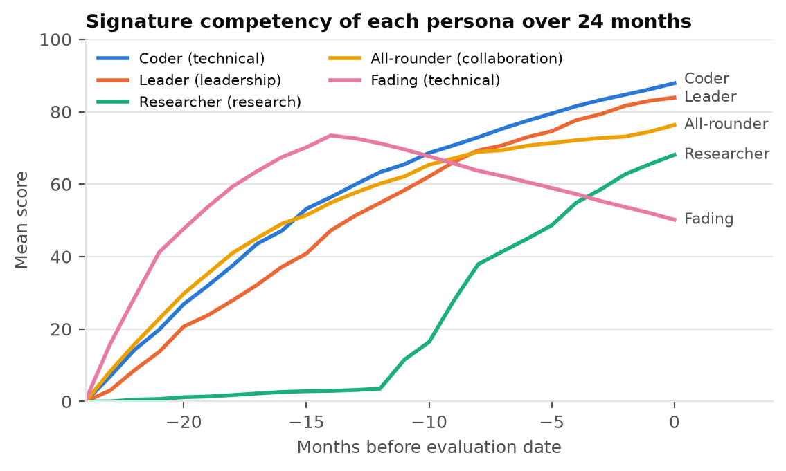
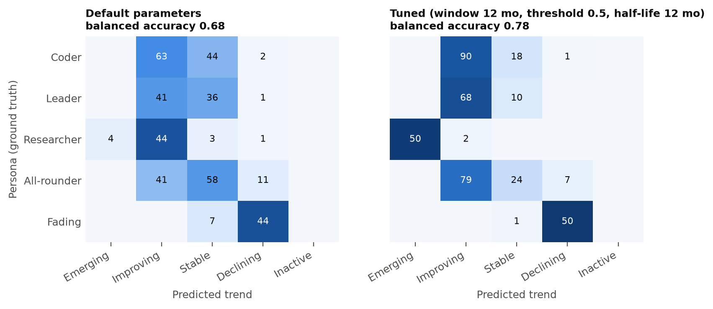
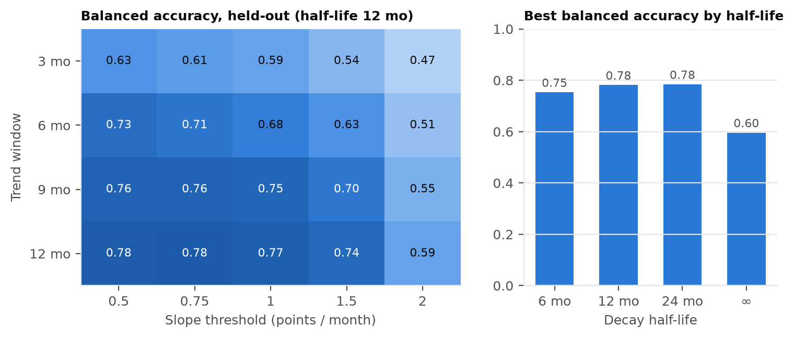
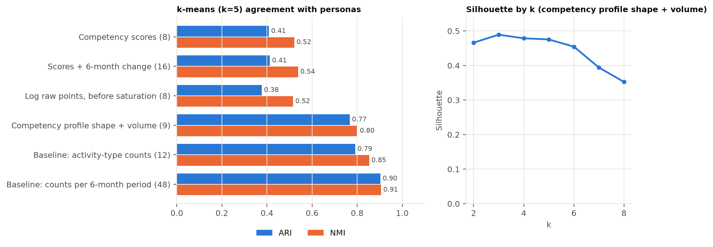
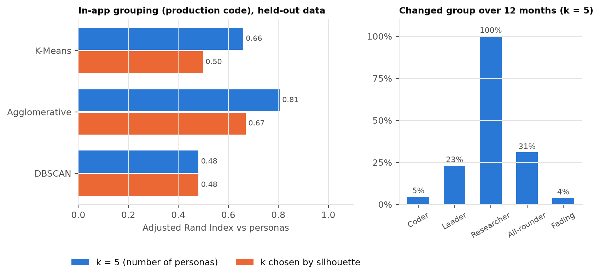
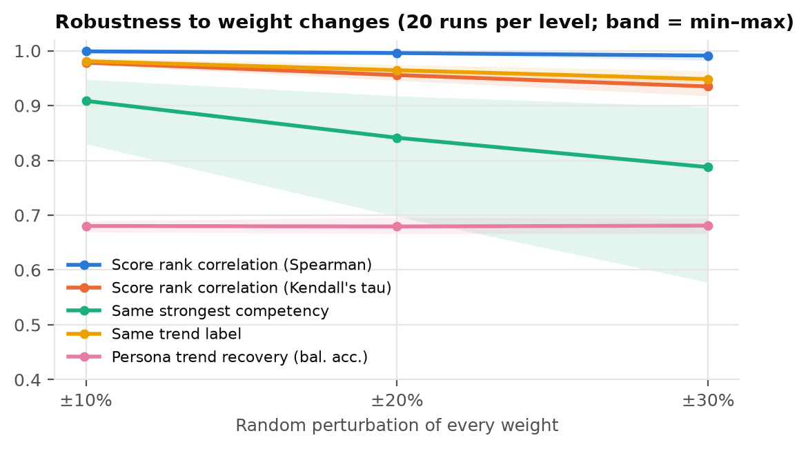

# Evaluation of the Competency Evolution Framework

_Generated by `python -m app.evaluation.run` · evaluation date 2026-09-30 · runtime 67.4 s._

## Key findings

1. **Trend detection recovers the intended trajectories well above chance.** Held-out balanced accuracy is 0.68 with the default parameters and 0.78 after tuning (window 12 months, threshold 0.5 points/month; chance ≈ 0.20). Tuning lowers recall for All-rounder, whose scores are still rising slowly after 24 months.
2. **Forgetting (decay) is essential.** Without decay the best balanced accuracy falls to 0.60 (vs 0.78 with a 12-month half-life): declining learners cannot be detected at all.
3. **The competency profile's *shape* identifies learner types; its *level* does not.** Clustering on raw scores gives ARI 0.41, while the profile shape reaches 0.77, close to the activity-count baseline (0.79). Time-bucketed raw counts do best (0.90), as the personas are defined by timing patterns.
4. **In-app groups and their movement are meaningful.** The production grouping (K-Means, k = 5) reaches ARI 0.66 against the personas (Agglomerative 0.81, DBSCAN 0.48); 100% of researchers change group over the year as their research emerges, against 16% of other learners.
5. **Results are robust to the expert weights.** With every weight perturbed by up to ±30%, score rankings keep a Spearman correlation of 0.98 or more (Kendall's τ ≥ 0.92), 95% of trend labels are unchanged and persona recovery stays at 0.68. The single *strongest* competency is the least stable output (79% unchanged) because of near-ties.
6. **It scales comfortably for a department.** Full insights for one learner take 7.1 ms; the cohort view for 1000 learners needs 1.1 s of computation.

## 1. Method

Learner data is synthetic: 200 learners per dataset, 24 months of activity, generated by the production generator (`app/services/synthetic.py`). Each learner follows one of five personas whose intended trajectory is known, which gives ground truth for evaluating the analytics. Parameters are **tuned on datasets with seeds 1, 2, 3** and **reported on held-out datasets with seeds 4, 5**.

| Persona | Learners | Activities / learner | Signature competency | Intended trend |
|---|---:|---:|---|---|
| Coder | 57 | 20.6 | Technical | Improving |
| Leader | 36 | 16.6 | Leadership | Improving |
| Researcher | 23 | 12.0 | Research | Emerging or Improving |
| All-rounder | 54 | 19.7 | Collaboration | Stable |
| Fading | 30 | 11.4 | Technical | Declining |

## 2. Trend detection (E1, E2)

A learner's trend label for their signature competency is compared with the persona's intended trend. Because persona sizes differ, the headline metric is **balanced accuracy** (mean of per-persona recall; chance ≈ 0.2).

| Configuration | Tuning seeds | Held-out seeds |
|---|---:|---:|
| Default (half-life 12 mo, window 6 mo, threshold 1) | 0.614 | **0.684** |
| Best on tuning seeds (half-life 12 mo, window 12 mo, threshold 0.5) | 0.769 | **0.779** |

Per-persona recall on held-out data:

| Persona | Default | Tuned |
|---|---:|---:|
| Coder | 57.8% | 82.6% |
| Leader | 52.6% | 87.2% |
| Researcher | 92.3% | 100.0% |
| All-rounder | 52.7% | 21.8% |
| Fading | 86.3% | 98.0% |
| **Balanced accuracy** | **0.683** | **0.779** |
| Accuracy | 0.635 | 0.710 |

**Design decision.** The deployed app keeps the default 6-month window and 1.0 points/month threshold. Longer windows score higher against the personas, whose trajectories are defined over two years, but a learner-facing label should react to the last few months of activity so that feedback is timely and actionable; the tuned setting also labels most all-rounders 'Improving'. The window and threshold are parameters (`TrendParams`), so an institution can choose the other side of this trade-off.

Best held-out balanced accuracy for each decay half-life (∞ = no decay):

| Half-life | Best balanced accuracy |
|---|---:|
| 6 months | 0.754 |
| 12 months | 0.782 |
| 24 months | 0.784 |
| ∞ | 0.596 |

## 3. Clustering learners (E3)

k-means (k = 5, standardised features) is compared with the persona labels using the Adjusted Rand Index (ARI, 0 = chance, 1 = perfect) and Normalised Mutual Information (NMI). Two baselines use raw activity counts without the competency model.

| Features | ARI | NMI |
|---|---:|---:|
| Competency scores (8) | 0.408 | 0.521 |
| Scores + 6-month change (16) | 0.412 | 0.538 |
| Log raw points, before saturation (8) | 0.377 | 0.515 |
| Competency profile shape + volume (9) | 0.767 | 0.801 |
| Baseline: activity-type counts (12) | 0.791 | 0.853 |
| Baseline: counts per 6-month period (48) | 0.903 | 0.906 |

Cluster membership per persona (competency profile shape + volume (9), first held-out dataset):

| Persona | C0 | C1 | C2 | C3 | C4 |
|---|---:|---:|---:|---:|---:|
| Coder | 0 | 55 | 0 | 0 | 2 |
| Leader | 3 | 0 | 0 | 33 | 0 |
| Researcher | 0 | 1 | 21 | 0 | 1 |
| All-rounder | 47 | 1 | 0 | 6 | 0 |
| Fading | 0 | 5 | 0 | 0 | 25 |

Silhouette is highest at k = 3 (0.49): without labels the data forms fewer natural groups than there are personas, mainly because coders and all-rounders overlap.

### 3b. In-app learner groups (production code)

The Learner groups page (`app/services/clustering.py`) is run unchanged on the held-out datasets: features are profile shape + volume, K-Means is fitted on three periods pooled (12 and 6 months ago, now), and Agglomerative (Ward) and DBSCAN are compared on the current period.

| Algorithm | ARI (k = 5) | NMI (k = 5) | ARI (auto k) | Silhouette (auto k) | Davies–Bouldin (auto k) | Unassigned (auto k) |
|---|---:|---:|---:|---:|---:|---:|
| K-Means | 0.660 | 0.759 | 0.499 | 0.508 | 0.596 | 0% |
| Agglomerative | 0.806 | 0.855 | 0.670 | 0.491 | 0.711 | 0% |
| DBSCAN | 0.481 | 0.595 | 0.481 | 0.426 | 0.625 | 24% |

Silhouette chose k = 4, 4 on the held-out datasets. One grouping takes 0.39 s for 200 learners.

Share of learners whose group changed between 12 months ago and now (k = 5), a check of the transition analysis:

| Persona | Changed group |
|---|---:|
| Coder | 4.6% |
| Leader | 23.1% |
| Researcher | 100.0% |
| All-rounder | 30.9% |
| Fading | 3.9% |

## 4. Sensitivity to the weight matrix (E4)

Every non-zero weight is multiplied by a random factor in [1 − x, 1 + x] (20 runs per level, both held-out datasets). Scores are compared with the unperturbed model.

| Perturbation | Spearman ρ | Kendall's τ | Same strongest competency | Same trend label | Persona recovery (bal. acc.) |
|---|---:|---:|---:|---:|---:|
| ±10% | 0.999 (min 0.998) | 0.978 (min 0.974) | 90.9% | 98.1% | 0.680 (min 0.669) |
| ±20% | 0.996 (min 0.994) | 0.956 (min 0.946) | 84.1% | 96.4% | 0.679 (min 0.666) |
| ±30% | 0.991 (min 0.982) | 0.935 (min 0.918) | 78.8% | 94.8% | 0.681 (min 0.666) |

## 5. Scalability (E5)

Pure computation time on one CPU core (mean 17.0 activities per learner), excluding database access.

| Learners | Current scores | Scores + 6-month trends (cohort view) |
|---:|---:|---:|
| 200 | 0.04 s | 0.22 s |
| 500 | 0.09 s | 0.54 s |
| 1000 | 0.17 s | 1.08 s |

A single learner's full insights (36-month series, trends, recommendations, timeline) take **7.1 ms**.

## 6. Threats to validity

- **Synthetic ground truth.** Personas encode the designer's assumptions about how competencies develop; results show the analytics recover *those* patterns, not that the patterns match real learners. A pilot with real learner data is needed.
- **Circularity.** The generator and the scoring model share the activity-type vocabulary, so clustering on competency features is expected to perform reasonably; the raw-count baselines are included to show what the model adds.
- **Label noise.** Activity counts per 6-month window are small (Poisson), so some learners genuinely deviate from their persona's intended trend within the window; perfect recovery is not attainable.
- **All-rounder ground truth.** 'Stable' assumes their scores have plateaued, but with a 12-month half-life scores are still rising slowly after 24 months, which lowers measured recall for this persona.
